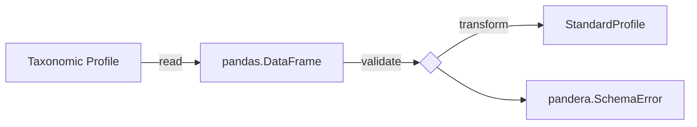

# Supporting New Taxonomic Profilers

A good way to contribute to the taxpasta project is to add support for a new
taxonomic profiler. This mostly boils down to creating three new Python files
(modules) and filling them with life, as well as testing them appropriately.

The taxpasta package is designed to follow a [hexagonal
architectural](https://en.wikipedia.org/wiki/Hexagonal_architecture_(software))
style. That means, the directory structure may be somewhat unfamiliar to you.
This architectural style is reflected by the Python package organization which has three
sub-packages: [`taxpasta.domain`][taxpasta.domain], [`taxpasta.application`][taxpasta.application], and [`taxpasta.infrastructure`][taxpasta.infrastructure].
Fortunately, you don't really need to care about that (unless you want to :wink:), as long
as you follow this guide. For supporting a new taxonomic profiler, three new Python
modules only need to be placed in
`taxpasta/infrastructure/application/` and their tests mostly in
`tests/unit/infrastructure/application/`.

What do those three new modules need to do? Basically, taxpasta needs to be able
to read a taxonomic profile, validate its correctness as much as possible, and
finally transform it to what we call the
[`StandardProfile`][taxpasta.domain.standard_profile.StandardProfile]. All
further processing and logic is based on the `StandardProfile` so you don't need
to change anything else!



## Development Process

We recommend that you start by thinking about how the taxonomic profile from the file,
that means, the output of the tool that you want to support, should be represented within
Python. According to the above diagram, you will start in the middle at the validation step.

If you're feeling very professional, you can also first create your test cases. This is a
principle called [test-driven development (TDD)](https://en.wikipedia.org/wiki/Test-driven_development) which is a great way to check your assumptions
about your code, helps you spot mistakes in your code early, and generally helps designing
your code to be more testable (although we arguably already did that for you).

### 1. Schema Model

We are assuming that all profile data is tabular and therefore
[pandas](https://pandas.pydata.org/) is our choice for handling this data.
Should this assumption somehow not hold, please contact us on [Slack](https://nfcore.slack.com/archives/C031QH57DSS) or create a
[GitHub Discussion](https://github.com/taxprofiler/taxpasta/discussions/new) topic.
In order to perform validation of tabular data, we use [pandera schema
models](https://pandera.readthedocs.io/en/stable/schema_models.html). Therefore, 
please place a
new Python module into `taxpasta/infrastructure/application/` that will contain the
schema model expressing the shape and form of your data. The name of the class that you
create should follow Python conventions (be in [Pascal-case](https://en.wikipedia.org/wiki/Camel_case)) and should be composed of
the tool name, for example, `Kraken2Profile` for the kraken2 tool. Your new module (Python file)
should be named like your class, except be all lower case and with underscores `_`
separating words, e.g., `kraken2_profile.py`.

When creating your schema model, you need to think about what columns should be there,
what data types they represent, and what kind of constraints should be placed on them
for validation. Below follows an example for kraken2. Please read up on [pandera schema
models](https://pandera.readthedocs.io/en/stable/schema_models.html) to understand
all the details but briefly: we expect particularly named columns, in the order defined
in the class, with specific data types, and we expect the numeric data types to be
within certain intervals.

```python
from typing import Optional

import pandas as pd
import pandera as pa
from pandera.typing import Series


class Kraken2Profile(pa.SchemaModel):
    """Define the expected kraken2 profile format."""

    percent: Series[float] = pa.Field(ge=0.0, le=100.0)
    clade_assigned_reads: Series[int] = pa.Field(ge=0)
    direct_assigned_reads: Series[int] = pa.Field(ge=0)
    num_minimizers: Optional[Series[int]] = pa.Field(ge=0)
    distinct_minimizers: Optional[Series[int]] = pa.Field(ge=0)
    taxonomy_lvl: Series[pd.CategoricalDtype] = pa.Field()
    taxonomy_id: Series[pd.CategoricalDtype] = pa.Field()
    name: Series[str] = pa.Field()

    class Config:
        """Configure the schema model."""

        coerce = True
        ordered = True
        strict = True
```

In order to test this schema, you need to place a test module in the equivalent directory 
`tests/unit/infrastructure/application/`. The name of the file should be the same as your module above
but prefixed with `test_`, for example, `test_kraken2_profile.py`. In there, you need to import
your code module and perform a number of tests on it. In general, pandera is a well tested Python
package itself so we can assume that it works as advertised. These tests are there to confirm
that the data structure that you have in mind for the profile and your schema model match up. Also,
in case you need to modify the schema, these tests will ensure that your previous assumptions
still hold. You can look at existing tests cases for inspiration.

### 2. Reader

You could then continue to either with the reading or transformation part of the schema presented above.
We will begin with the reader so that you can get some real data into Python.

For reading a taxonomic profile from a new tool, you need to inherit a new class
from the abstract [`ProfileReader`][taxpasta.application.ProfileReader]. This
new class and module should follow the naming scheme mentioned above,
as an example `Kraken2ProfileReader` to support `kraken2` in `kraken2_profile_reader.py`.  Since you need to import
your base class from a different package branch, you should use an absolute
import.

```python
from taxpasta.application import ProfileReader


class Kraken2ProfileReader(ProfileReader):
```

What exactly the reader needs to do is very tool dependent. You probably want to use one
of the many `pandas.read_*` functions with specific arguments tailored to reading your
particular file format. Whatever you do, you need to ensure that the output returned by
calling the `read` class method follows the schema that you have defined before. Again,
you can look at existing code for inspiration.

Don't forget to test that your reader creates expected output by adding a few test cases
into a module that you place in `tests/unit/infrastructure/application/`. To test your
reader you probably want to add some appropriate files into `tests/data/<tool>`, too, and
make them accessible with a pytest fixture function which you place into `tests/conftest.py`.
Take a look at the kraken2 fixture:

```python
@pytest.fixture(scope="module")
def kraken2_data_dir(data_dir: Path) -> Path:
    """Provide the path to the kraken2 data directory."""
    return data_dir / "kraken2"
```

### 3. Validation & Transformation

 The
validation is automatically performed by decorating with [`pandera.check_types`](https://pandera.readthedocs.io/en/stable/schema_models.html) and annotating the
`transform` class method of the standardisation service, for example,

```python
import pandera as pa
from pandera.typing import DataFrame

from taxpasta.application import ProfileStandardisationService
from taxpasta.domain import StandardProfile

from .kraken2_profile import Kraken2Profile


class Kraken2ProfileStandardisationService(ProfileStandardisationService):
    @classmethod
    @pa.check_types
    def transform(
        cls, profile: DataFrame[Kraken2Profile]
    ) -> DataFrame[StandardProfile]:
```

Finally, we need to transform the specific taxonomic profile into our standard
profile. Similarly to the profile reader, there exists an abstract
[`ProfileStandardisationService`][taxpasta.application.ProfileStandardisationService]
that you need to inherit from. The new module should be placed into
`taxpasta/infrastructure/application/` and the naming should follow the
conventions, as an example, `Kraken2ProfileStandardisationService` class in a
`kraken2_profile_standardisation_service.py` module.

```python
import pandera as pa
from pandera.typing import DataFrame

from taxpasta.application import ProfileStandardisationService
from taxpasta.domain import StandardProfile

from .kraken2_profile import Kraken2Profile


class Kraken2ProfileStandardisationService(ProfileStandardisationService):
    @classmethod
    @pa.check_types(lazy=True)
    def transform(
        cls, profile: DataFrame[Kraken2Profile]
    ) -> DataFrame[StandardProfile]:
```

The `pa.check_types` decorator validates the class method's input and output
using the type annotations and the defined schema models.

The `transform` class method itself needs to modify the given `pandas.DataFrame` such that
the returned result looks like the [`StandardProfile`][].

In order to ensure that the whole three step process from the diagram: read, validate, transform
produces expected results, we will now create a new kind of test; an integration test that
uses all the classes that we have created. Thus we need a new test module in `tests/integration/`,
you can name it `test_<tool>_etl.py`, e.g., `test_kraken2_etl.py`.

This test has few lines of code but thanks to the `pa.check_types` decorator performs
all the work that we need. Again, for kraken2 this looks like:

```python
from taxpasta.infrastructure.application import (
    Kraken2ProfileReader,
    Kraken2ProfileStandardisationService,
)


def test_kraken2_etl(
    kraken2_data_dir: Path,
    filename: str,
):
    """Test that kraken2 profiles are read, validated, and transformed correctly."""
    Kraken2ProfileStandardisationService.transform(
        Kraken2ProfileReader.read(kraken2_data_dir / filename)
    )
```

It is a good idea to include some known invalid files such that you can be sure that
your schema catches input errors.

## Overview

Overall, taking kraken2 as an example once more, your classes should have the same relationships as shown in the diagram below (open the image in a new tab for a better view).


