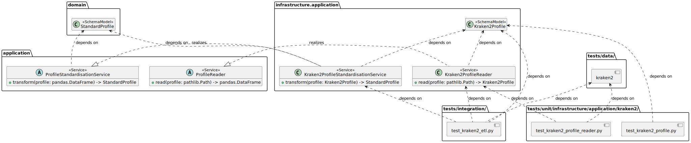

# Supporting New Taxonomic Profilers

A good way to contribute to the taxpasta project, is to add support for a new taxonomic profiler. This mostly boils down to creating three new Python modules and filling them with life.

The taxpasta package is designed to follow a [hexagonal architectural](https://en.wikipedia.org/wiki/Hexagonal_architecture_(software)) style. That means, the directory structure may be somewhat unfamiliar to you. Fortunately, three new Python modules only need to be placed in `taxpasta/infrastructure/application/` so it's rather simple.

What do those three new modules need to do? Basically, taxpasta needs to be able to read a taxonomic profile, validate its correctness as much as possible, and finally transform it to what we call the [`StandardProfile`][taxpasta.domain.standard_profile.StandardProfile]. All further processing and logic is based on the `StandardProfile` so you don't need to change anything else!


## 1. Read

For reading a taxonomic profile from a new tool, you need to inherit a new class from the abstract [`ProfileReader`][taxpasta.application.ProfileReader]. This new class should have a name corresponding to the tool that you want to support, as an example `Kraken2ProfileReader` to support `kraken2`. Your new module should be named like your class, except all lowercase and underscores `_` separating words, e.g., `kraken2_profile_reader.py`. Since you need to import your base class from a different package branch, you should use an absolute import.

```python
from taxpasta.application import ProfileReader


class Kraken2ProfileReader(ProfileReader):
```

## 2. Validate

We are assuming that all profile data is tabular and therefore [pandas](https://pandas.pydata.org/) is our choice for handling this data. In order to perform validation of tabular data, we use [pandera schema models](https://pandera.readthedocs.io/en/stable/schema_models.html). The validation is automatically performed by decorating and annotating the `transform` classmethod of the standardisation service, for example,

```python
import pandera as pa
from pandera.typing import DataFrame

from taxpasta.application import ProfileStandardisationService
from taxpasta.domain import StandardProfile

from .kraken2_profile import Kraken2Profile


class Kraken2ProfileStandardisationService(ProfileStandardisationService):
    @classmethod
    @pa.check_types
    def transform(
        cls, profile: DataFrame[Kraken2Profile]
    ) -> DataFrame[StandardProfile]:
```

For this to work, we need to define a corresponding schema model. Please place a new Python module into `taxpasta/infrastructure/application/` using the same naming scheme as before, for example, name the class `Kraken2Profile` and the file `kraken2_profile.py`. For a full description on how to define a schema model, please read the [pandera documentation](https://pandera.readthedocs.io/en/stable/schema_models.html). As an example:

```python
import numpy as np
import pandas as pd
import pandera as pa
from pandera.typing import Series


class Kraken2Profile(pa.SchemaModel):
    """Define the expected kraken2 profile format."""

    percentage: Series[float] = pa.Field(ge=0.0, le=100.0)
    clade_assigned_reads: Series[int] = pa.Field(ge=0)
    direct_assigned_reads: Series[int] = pa.Field(ge=0)
    taxonomy_lvl: Series[pd.CategoricalDtype] = pa.Field()
    taxonomy_id: Series[pd.CategoricalDtype] = pa.Field()
    name: Series[str] = pa.Field()

    @classmethod
    @pa.check("percentage", name="compositionality")
    def check_compositionality(cls, percentage: Series[float]) -> bool:
        """Check that the percentages add up to a hundred."""
        # Kraken2 reports percentages only to the second decimal, so we expect
        # some deviation.
        return bool(np.isclose(percentage.sum(), 100.0, atol=0.01))

    class Config:
        coerce = True
        ordered = True
        strict = True
```

## 3. Transform

Finally, we need to transform the specific taxonomic profile into our standard profile. Similarly to the profile reader, this should be done by another service class. There exists an abstract [`ProfileStandardisationService`][taxpasta.application.ProfileStandardisationService] that you need to inherit from. The new module should be placed into `taxpasta/infrastructure/application/` and the naming should follow the conventions, as an example, `Kraken2ProfileStandardisationService` class in a `kraken2_profile_standardisation_service.py` module.

```python
import pandera as pa
from pandera.typing import DataFrame

from taxpasta.application import ProfileStandardisationService
from taxpasta.domain import StandardProfile

from .kraken2_profile import Kraken2Profile


class Kraken2ProfileStandardisationService(ProfileStandardisationService):
    @classmethod
    @pa.check_types
    def transform(
        cls, profile: DataFrame[Kraken2Profile]
    ) -> DataFrame[StandardProfile]:
```

The `pa.check_types` decorator validates the classmethod's input and output using the defined schema models.

## Overview


