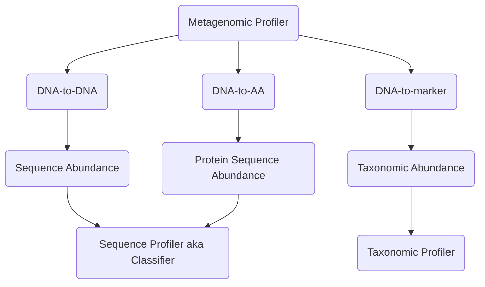

# Terminology

!!! info

    Even though we have very specific concepts in mind when talking about the
    different tools and their results, we don't (yet) apply this terminology
    consistently everywhere. We will do so as time permits. In the meantime,
    please study the concepts presented herein carefully and form your own
    judgement how they apply elsewhere in the documentation.

Our thinking about terminology is strongly influenced by the categorisation proposed by Sun _et al._ (2021)[^1].
To summarise: Broadly, we call all of these tools _metagenomic profilers_. They can be
more finely grouped by considering their type of reference database and thus the kind of relative abundance profile
produced. Furthermore, the underlying method for sequencing read classification impacts
the [computational complexity](https://en.wikipedia.org/wiki/Computational_complexity) (time and database size/memory)
dramatically.

[^1]: Sun, Z., Huang, S., Zhang, M., Zhu, Q., Haiminen, N., Carrieri, A. P., Vázquez-Baeza, Y., Parida, L., Kim, H.-C., Knight, R., & Liu, Y.-Y. (2021). Challenges in benchmarking metagenomic profilers. _Nature Methods_. <https://doi.org/10.1038/s41592-021-01141-3>

## Criteria

### Type of Abundance/Profiler

Our main criteria for categorizing a metagenomic profiler are summarised in the list below,
as well as shown in the schema.

-   Reference database:
    -   **DNA-to-DNA**, aka a metagenome library
    -   **DNA-to-AA**, aka a genomic library of protein coding sequences (amino-acid)
    -   **DNA-to-marker**, aka marker gene, aka gene families selection
-   Result:
    -   relative **sequence abundance**
    -   relative **protein sequence abundance**
    -   relative **taxonomic abundance**

### Differences in Abundance

A key takeaway from Sun _et al._ (2021)[^1] is also that the different kinds of relative
abundances cannot easily be interconverted by, for example, normalizing sequence abundance by genome size.
Reasons for this include, in particular for metagenome-assembled genomes (MAGs), inaccurate
genome size, unknown polyploidy. Sun _et al._ (2021)[^1] observed that broadly sequence abundance
tends to overestimate large genomes and underestimates smaller genomes. Any attempts to
perform normalization by, for example, genome size, are just as likely to introduce
systematic errors than improve the results. Furthermore, α-diversity measures
appear to be statistically significantly affected by the type of relative abundance - higher for taxonomic abundance.
The type also affects β-diversity although the effect is harder to quantify.

### Classification Method

Additionally, we may be interested in the method used to classify sequencing reads.

-   Method:
    -   index
    -   alignment

## Categorisation

| Tool        | Reference Database     | Result                                                    | Method                                       |
| ----------- | ---------------------- | --------------------------------------------------------- | -------------------------------------------- |
| Bracken     | See Kraken2            | See Kraken2                                               | Bayesian re-estimation of sequence abundance |
| Centrifuge  | DNA-to-DNA             | Sequence abundance (optionally normalized by genome size) | FM index                                     |
| DIAMOND     | DNA-to-AA              | Protein sequence abundance                                |                                              |
| Kaiju       | DNA-to-AA              | Protein sequence abundance                                |                                              |
| Kraken2     | DNA-to-DNA (DNA-to-AA) | (Protein) sequence abundance                              | k-mer index                                  |
| KrakenUniq  | DNA-to-DNA             | Sequence abundance                                        | see Kraken                                   |
| MEGAN6/MALT | DNA-to-DNA             | Sequence abundance                                        | alignment                                    |
| MetaPhlAn   | DNA-to-marker          | Taxonomic abundance                                       | alignment (bowtie2)                          |
| mOTUs       | DNA-to-marker          | Taxonomic abundance                                       | alignment (bowtie2)                          |
