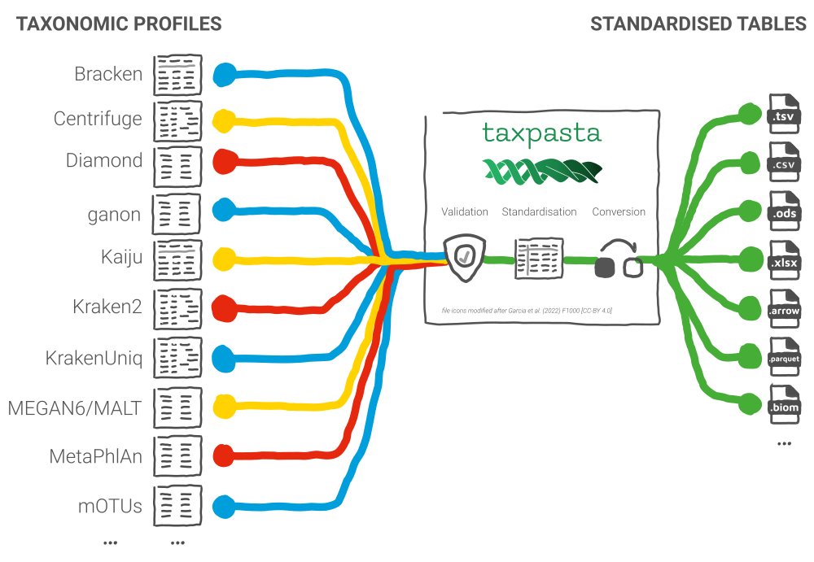

# Summary

Metagenomic analysis is largely concerned with untargeted genetic
characterisation of the taxonomic and functional composition of whole
communities of organisms. Researchers ask questions from metagenomic sequencing
such as 'who is present' (what organisms are present), and 'what are they doing'
(which functions are they performing)? The nature of this field is such that it
intersects with ecology, medicine, statistics, and bioinformatics. Facilitated
by the development of Next-Generation Sequencing (NGS), the field often
generates large datasets consisting of many samples (hundreds) and many
sequencing reads (tens of millions).

In part, due to the interdisciplinary nature of the field, but more importantly,
due to the lack of a gold standard, the task of accurately identifying the
taxonomic origin of each sequencing read is a popular and unresolved
bioinformatics problem. Furthermore, the sizes of the datasets present
interesting challenges for computational efficiency, which may require trading
off accuracy for speed and memory use. Thus, there exists a diverse number of
bioinformatics tools in order to analyse metagenomic sequencing data and produce
metagenomic profiles. However, most of those tools have invented their own
(often tabular) result formats, which complicates downstream analysis and in
particular comparison across tools.

TAXPASTA is a standalone command-line tool written in Python
[@van_rossum_python_1995] that aims to standardise the diverse range of
metagenomic profiler output formats to simple tabular formats that are readily
consumed in downstream applications. TAXPASTA facilitates cross-comparison
between taxonomic profiling tools without the need for external or dedicated
modules or plugins needed of other 'dedicated' metagenomic profile formats.

# Statement of need

TAXPASTA is a Python package for standardising and aggregating metagenomic
profiles coming from a wide range of tools and databases (\autoref{fig:summary}). It was developed as
part of the nf-core/taxprofiler pipeline[^12] within the
nf-core community [@ewels_nf-core_2020].

[^12]: See [nf-core/taxprofiler](https://nf-co.re/taxprofiler) and at DOI [10.5281/zenodo.7728364](https://doi.org/10.5281/zenodo.7728364).

Across profilers, relative abundances can be reported in read counts, fractions,
or percentages, as well as any number of additional columns with extra
information. Taxa can be recorded using taxonomic identifiers, taxonomic names
and/or in some cases semi-colon-separated taxonomic 'paths' (lineages). These
can also be formatted in different ways, from typical tables, to including
'indented' taxonomy trees such as in the Kraken [@wood_improved_2019] family of
profilers. Manually parsing these for comparison can be an arduous, error-prone
task, with researchers often reverting to custom R [@r_core_team_r_2023] and
Python scripting, or even manual correction in spreadsheet software.

With TAXPASTA, all of those formats can be converted into a single, standardised
output, that, at a minimum, contains taxonomic identifiers and their relative
abundances as integer counts. It can also be used to aggregate profiles across
samples from the same profiler and merge them into a single, standardised table.
Having a singular format facilitates downstream analyses and comparisons.
TAXPASTA is not the first tool to attempt standardising metagenomic profiles,
but it is by far the most comprehensive in terms of supported profilers and
output formats.

There exists an initiative to benchmark and compare profilers, as well as
provide guidance on their fitness for purpose; the Critical Assessment of
Metagenome Interpretation (CAMI) challenges [@sczyrba_critical_2017;
@meyer_critical_2022]. For that initiative, the Open-community Profiling
Assessment tooL (OPAL) [@meyer_assessing_2019] was developed. Creating a
community wide assessment faced many of the challenges presented here, however,
the chosen solution was to mandate a single output format[^8] for all profilers
participating in the challenge. Furthermore, OPAL is an integrated tool
performing assessment and visualization, whereas TAXPASTA follows the UNIX
philosophy[^9] of doing one thing and doing it well. The BIOM format
[@mcdonald_biological_2012] was created with a similar intention of
standardising a storage format for microbiome analyses. However, transforming
metagenomic profiles into that format is entirely left up to the user. The
format also is not easily loadable into spreadsheet software, and external
libraries are required for loading the format into data analysis languages such
as R. The QIIME™2 _next-generation microbiome bioinformatics platform_
[@bolyen_reproducible_2019] also maintains internally consistent formats for
storing and processing metagenomic data that new tools can plug into, however
this suite of software was originally designed for the analysis of 16S rRNA
amplicon sequencing data [@caporaso_qiime_2010], and whole-genome, shotgun
metagenomic sequencing data is only supported via community plugins[^11]. While
some of the taxonomic profilers also come with scripts to convert their output
into another format and/or merge multiple profiles into a single table, such as
the Krakentools companion package [@lu_metagenome_2022], these are often focused
on the specific tool or family of tools. Thus, users would have to become
proficient in yet another piece of software per tool or family of tools for the sake of
consistent output files.

[^8]: <https://github.com/bioboxes/rfc/tree/master/data-format>
[^9]: <https://en.wikipedia.org/wiki/Unix_philosophy#Origin>
[^11]: <https://library.qiime2.org/plugins/>

TAXPASTA supports reading a wide range of formats of primarily shotgun-metagenomic
profiling tools and formats, and it is designed to be used as a
building block in metagenomic analysis workflows. At the time of writing, it is
able to read profiles from nine different profilers, namely Bracken
[@lu_bracken_2017], Centrifuge [@kim_centrifuge_2016], DIAMOND
[@buchfink_sensitive_2021], ganon [@piro_ganon_2020], Kaiju [@menzel_fast_2016], Kraken2
[@wood_improved_2019], KrakenUniq [@breitwieser_krakenuniq_2018], MALT/MEGAN6
[@huson_megan_2016; @vagene_salmonella_2018], MetaPhlAn
[@blanco-miguez_extending_2023],and mOTUs
[@ruscheweyh_cultivation-independent_2022]. Supporting more profilers is already
planned, and detailed documentation for community contributions is
provided[^10].

[^10]: <https://taxpasta.readthedocs.io/en/latest/contributing/supporting_new_profiler/>

For maximum compatibility, TAXPASTA offers a wide range of familiar output file
formats, such as text-based, tabular formats (CSV[^1], TSV[^2]), spreadsheets
(ODS[^3], XLSX[^4]), optimized binary formats (Apache Arrow[^5] and
Parquet[^6]), and the HDF5-based[^7] BIOM format [@mcdonald_biological_2012].
We hope that this will let researchers plug and play TAXPASTA into their
existing analysis workflows in a wide range of settings.

[^1]: <https://en.wikipedia.org/wiki/Comma-separated_values>
[^2]: <https://en.wikipedia.org/wiki/Tab-separated_values>
[^3]: <https://en.wikipedia.org/wiki/OpenDocument>
[^4]: <https://en.wikipedia.org/wiki/Office_Open_XML>
[^5]: <https://arrow.apache.org/>
[^6]: <https://parquet.apache.org/>
[^7]: <https://www.hdfgroup.org/solutions/hdf5/>

# Acknowledgements

SS was supported by "Rapid establishment of comprehensive laboratory pandemic
preparedness – RAPID-SEQ" (awarded to Prof. Jan Albert). MB and JAFY were
supported by the Max Planck Society. JAFY received funding from the Werner
Siemens-Stiftung ("Paleobiotechnology", awarded to Prof. Pierre Stallforth and
Prof. Christina Warinner). MB received funding from the Balance of Microverse
Cluster of Excellence (EXC 2051 – project ID 390713860, awarded to Prof.
Christina Warinner).

# References
